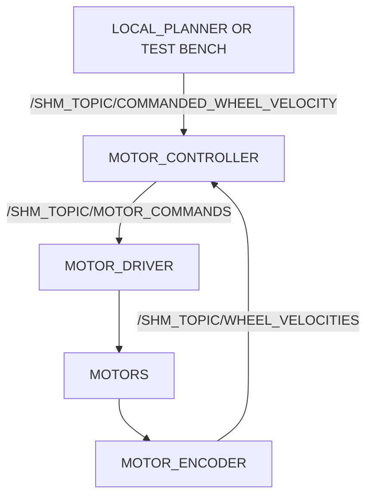

# Dream Mobile Platform

I have written [a blog post](https://ricoruotongjia.medium.com/set-up-raspberry-pi-4b-as-a-mobile-platform-7448e94a04dc) in terms of setting this up

## Core Features and Software Rationale

This package is a "one-stop-shop" for Rpi setup. That is, all functionalities are modular, and easy to start and end.

All our services are run inside [Byobu](https://www.byobu.org/) in a docker container.

Features

- LED Toggling

## Set up

1. Go through the set up steps [../../README.md] for basic Rpi set up
2. See the comments section in [Dockerfile](./Dockerfile) to pull the image and run a container
    - The container should have everything you need to running all functionalities
3. Start the byobu services using "dream_byobu". `dream_byobu <-l> <-b>`
    - Each input arg is optional. See documentation with `dream_byobu -h`
    
## Motor Control

Diagram

